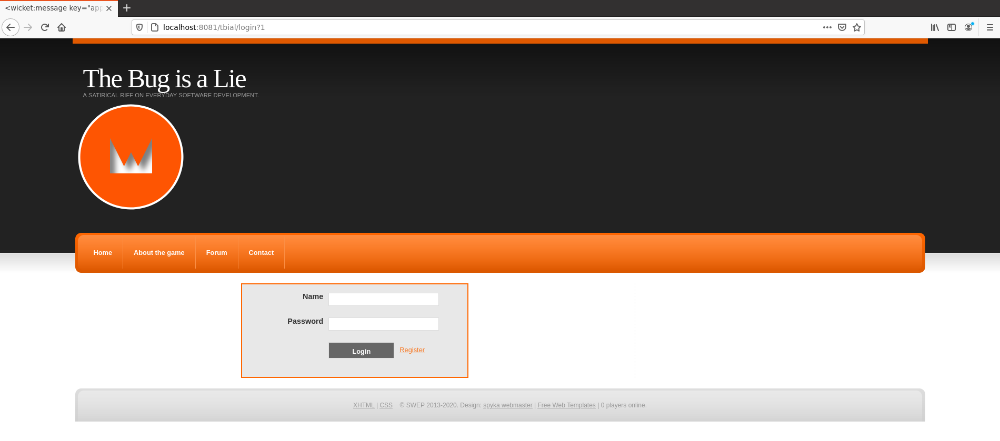

# Praktikum Software Engineering für Fortgeschrittene: The Bug is a Lie 🐞

Dieses Repository soll als Einstieg in das Praktikum dienen.
Es wird eine Beispielanwendung (Prototyp) bereitgestellt,
welche bereits einige der erforderlichen Technologien verwendet.

Weitere Informationen befinden sich im [Uni2Work](https://uni2work.ifi.lmu.de/course/W20/IfI/SWEP).

## Spielanleitung

Eine Spielanleitung ist [hier als PDF](TBIAL_Spielanleitung.pdf) verfügbar.
Die Spielkarten finden sich [hier als PDF](TBIAL_Spielkarten.pdf).

## Beispielanwendung ausführen

Dieses Repository stellt eine lauffähige Beispielanwendung zur Verfügung,
die bereits auf den notwendigen Technologien (Apache Tomcat, Apache Derby, Wicket) basiert.
Die Beispielanwendung ist als Projekt für Eclipse verfügbar.
Nachfolgend ist grob skizziert, wie das Projekt in Eclipse ausgeführt wird.

### Vorbereitung

- IDE installieren:
    + *Eclipse IDE for Java EE Developers* (Paket [hier](https://www.eclipse.org/downloads/eclipse-packages/) verfügbar)
      (**Achtung**: das EE Developers Paket wählen!)
    + oder *Intellij IDEA Ultimate Edition* (Paket [hier](https://www.jetbrains.com/idea/download/#section=linux) verfügbar)
- [*Apache Tomcat 8*](http://tomcat.apache.org/) (oder neuer) einrichten
    + in Eclipse: `Window/Preferences/Server/Runtime Environment -> Add -> Apache Tomcat 8` (oder neuer)
    + in Intellij: `Run/Edit Configurations -> Templates -> Tomcat Server -> Configure ...`  
      Dies benötigt eine lokale Tomcat-Installation. Die Paketquellen von Ubuntu können
      eine non-konforme Verzeichnisstruktur verwenden, weswegen wir die Verwendung der [offiziellen Pakete](http://tomcat.apache.org/) empfehlen.
- *Apache Derby* installieren und einrichten, Anleitung [hier](https://db.apache.org/derby/quick_start.html) verfügbar
- *Maven* installieren und einrichten, falls notwendig

### Projekt Setup und Ausführung

- Dieses Projekt-Repository auschecken und den Unterordner
  [`de.lmu.ifi.sosy.tbial`](de.lmu.ifi.sosy.tbial)
  als IDE-Projekt einrichten
- Apache Derby starten (als separaten Prozess!), ansonsten steht keine Datenbank zur Verfügung
    + Beispiel (bis Java 8): `java -jar DERBY_HOME/lib/derbyrun.jar server start`
    + In Java 9 und aufwärts: Seit dieser Version wird eine sehr aggresive *security policy* durchgesetzt, daher kommt es aufgrund einer Misskonfiguration in der JVM zu einer Exception. Als Lösung kann entweder [java.home]/lib/security/java.policy editiert und mit den entsprechenden Richtlinien angepasst werden, oder alternativ kann Derby auch mit folgendem Befehl ausgeführt werden:
      ```
      java -Dderby.system.home=.derby
           -Djava.security.manager
           -Djava.security.policy=de.lmu.ifi.sosy.tbial/etc/database/security.policy
           -Dderby.security.port=1527
           -Dderby.install.url=file:$DERBY_HOME/lib/
           -jar $DERBY_HOME/lib/derbyrun.jar server start
      ```
      
- Aus dem Unterordner `de.lmu.ifi.sosy.tbial` heraus ausführen:
    + `mvn exec:exec@create-development-db` einmalig, um die Datenbank zu initialisieren
    + `mvn install`, um das Projekt zu kompilieren
- Eclipse: `Run on Server`, dann den eingerichteten Tomcat-Server wählen, um das Projekt zu deployen
- Intellij: In der Run Configuration `Tomcat Server -> Deployment -> + -> Artifact -> de.lmu.ifi.sosy.tbial:war`

Sollten bei der erstmaligen Ausführung Fehler wie `ClassNotFound` bzgl. Wicket auftreten,
kann es sein, dass die IDE noch nicht alle benötigten Libraries erkannt hat.
Möglicherweise hilft dann `maven clean` oder ein Neustart der IDE,
gefolgt von den oben genannten Schritten.

### Screenshot

Die Webseite des gegebenen Prototyps sollte in etwa folgendermaßen aussehen:


